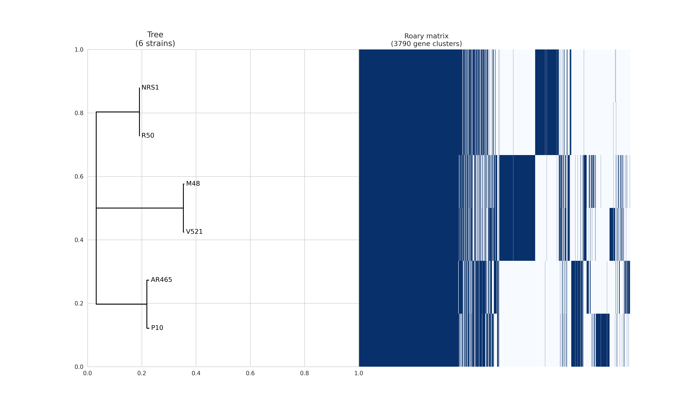

# 🧬 Pangenome Analysis

## What is a pangenome?

Pangenome refers to a pool of genes common or different among all individuals of a species. We need pangenome analysis to understand the genome diversity, including what genes are common or different among the variants of a specific specie. For instance, by identifying drought resistance genes in plants, we can improve crop breeding and produce better products.

---

## Pangenome analysis using Linux

Suppose we want to get an understanding of the genetic diversity within bacterial strains. Here we use *Staphylococcus aureus* as an example. We first download the following strains in FASTA format and store them in a directory called `sequences`:

```
https://www.ncbi.nlm.nih.gov/nuccore/CP013957.1  
https://www.ncbi.nlm.nih.gov/nuccore/CP030138.1  
https://www.ncbi.nlm.nih.gov/nuccore/CP039157.1  
https://www.ncbi.nlm.nih.gov/nuccore/CP029082.1  
https://www.ncbi.nlm.nih.gov/nuccore/CP026069.1  
https://www.ncbi.nlm.nih.gov/nuccore/CP039167.1
```

```bash
mkdir sequences
ls sequences
```

In order to perform pangenome analysis, we first need to create an environment:

```bash
conda config --add channels r
conda config --add channels conda-forge
conda config --add channels bioconda
```

You can check the channels using the following script:

```bash
conda config --show channels
```

Then we create an environment as well as install packages `prokka` and `roary`:

```bash
conda create -n pangenome prokka roary
```

We activate the environment by running:

```bash
conda activate pangenome
```

We may as well need to install the following packages:

```bash
pip install matplotlib --user
pip install numpy --user
pip install pandas --user
pip install biopython --user
```

---

## What is Prokka?

Fasta files contain the raw nucleotide sequence. We need the raw sequence to be annotated so that we know what regions are coding-regions, tRNA, rRNA, etc. Therefore, we use **Prokka** which produces the annotated version of FASTA files in `.gff` format, and we store the results in a new directory called `gffs`:

```bash
mkdir gffs
prokka --cpus 4 --kingdom Bacteria --prefix V521 --locustag V521 sequences/V521.sequence
```

Explanation of parameters:

* `--cpus 4`: Use 4 CPU threads to speed up the annotation process.
* `--kingdom Bacteria`: Specify the biological kingdom as Bacteria for accurate gene prediction.
* `--prefix V521`: Use "V521" as the prefix for all output files.
* `--locustag V521`: Assign "V521" as the locus tag prefix (used in gene IDs).
* `sequences/V521.sequence`: Input file—the FASTA sequence of the genome you want to annotate.

We transfer the results to `gffs` directory:

```bash
cp V521/V521.gff gffs/
```

We perform the same step for all the strains by annotating them using Prokka and storing the outputs in the `gffs` directory.

---

## What is Roary?

We use **Roary** on `.gff` files to create a presence/absence matrix across bacterial strains and to align genes that are common among strains. The output is produced in alignment (`.aln`) format.

```bash
roary -f roaryresult -p 4 -e -n -v --maft gffs/*.gff
```

Explanation of parameters:

* `-f roaryresult`: Specify the output directory for Roary results.
* `-p 4`: Use 4 CPU threads for faster processing.
* `-e`: Use BLASTP for a more accurate but slower comparison (versus the default CD-HIT).
* `-n`: Create a nucleotide (DNA) alignment of the core genes.
* `-v`: Verbose mode—print detailed progress information during the run.
* `--maft`: Outputs the core gene alignment in multi-FASTA format.
* `gffs/*.gff`: Input—use all GFF files from the `gffs` directory.

---

## Creating a Phylogenetic Tree

In order to create a phylogenetic tree, we can use the **FastTree** package and **GTR model** as a parameter.

GTR model is one of the most common models for nucleotide sequence evolution. Sometimes mutation across strains happens by gene swapping; but swapping happens at different rates. For example, A and G (both purines) are more likely to swap compared to C and T (one purine and one pyrimidine). The reason the result produced by GTR model is more accurate is because it takes this matter into consideration.

We run the following command on the produced `.aln` file:

```bash
FastTree -nt -gtr roaryresult/core_gene_alignment.aln > roaryresult/mytree.newick
```

---

## Visualizing the Output

We use the following Python code in order to display the output. We first download the raw version and place it in our directory, followed by another command:

Download script:
[https://github.com/sanger-pathogens/Roary/blob/master/contrib/roary\_plots/roary\_plots.py](https://github.com/sanger-pathogens/Roary/blob/master/contrib/roary_plots/roary_plots.py)

Then run:

```bash
python roary_plots.py --labels roaryresult/mytree.newick roaryresult/genome_presence_absence.csv
```

We store the produced PNG files in a directory:

```bash
mv pangenome*.png roaryresult/
```

---

## Interpretation of the Results

According to the produced presence/absence matrix, we can see the evolutionary relationship among the 6 *Staphylococcus aureus* strains:



* **NRS1 and R50** are very closely related.

* **M48 and V521** form another closely related group.

* **AR465 and P10** are yet another pair.

* The **length of the branches** represents genetic distance—longer means more differences.

* **Dark blue cells** show that the gene is present in that strain.

* **White cells** indicate the absence of a particular gene in that strain.

---

## Pie Chart Interpretation

The pie chart also indicates that out of all the genes:


* **2189 are core genes**: Present in all 6 strains → conserved and essential.
* **1601 are shell genes**: Present in some but not all strains → variable among different strains.

Since the pangenome has a **large core**, we can conclude that there's a **high genetic conservation** across strains, with **moderate variability** suggesting **strain-specific traits**.
